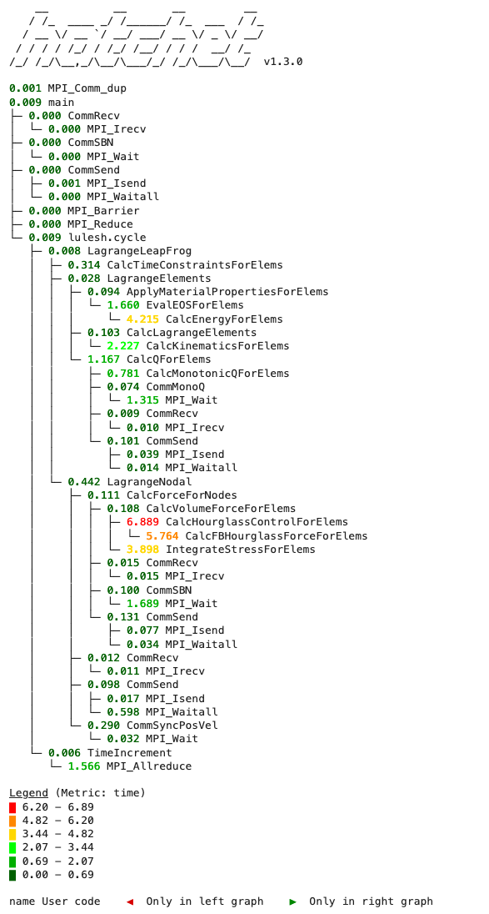

# Caliper Tutorial

Caliper is an instrumentation and performance profiling library for C, C++, and
Fortran that lets you integrate performance measurement capabilities directly
into your code. It is primarily designed for HPC codes, with support for MPI,
OpenMP, CUDA, and HIP programming models.

Caliper is great for:

* Lightweight always-on profiling

    You can enable profiling within the application, for example to create a
    simple performance report every time your program runs:

    ```
    Path                                       Time (E) Time (I) Time % (E) Time % (I) 
    main                                       0.008341 1.024472   0.812121  99.747630 
      lulesh.cycle                             0.000055 1.016131   0.005355  98.935509 
        LagrangeLeapFrog                       0.000053 1.016066   0.005160  98.929181 
          CalcTimeConstraintsForElems          0.001533 0.001533   0.149260   0.149260 
          LagrangeElements                     0.000256 0.155134   0.024925  15.104609 
            ApplyMaterialPropertiesForElems    0.001004 0.087512   0.097754   8.520599 
              EvalEOSForElems                  0.030174 0.086508   2.937889   8.422844 
                CalcEnergyForElems             0.056334 0.056334   5.484955   5.484955 
            CalcQForElems                      0.020190 0.029334   1.965798   2.856102 
              CalcMonotonicQForElems           0.009144 0.009144   0.890305   0.890305 
            CalcLagrangeElements               0.000825 0.038032   0.080326   3.702982 
              CalcKinematicsForElems           0.037207 0.037207   3.622656   3.622656 
          LagrangeNodal                        0.003753 0.859346   0.365411  83.670151 
            CalcForceForNodes                  0.000642 0.855593   0.062508  83.304741 
              CalcVolumeForceForElems          0.001580 0.854951   0.153837  83.242232 
                CalcHourglassControlForElems   0.772238 0.820102  75.188888  79.849162 
                  CalcFBHourglassForceForElems 0.047864 0.047864   4.660274   4.660274 
                IntegrateStressForElems        0.033269 0.033269   3.239233   3.239233 
        TimeIncrement                          0.000010 0.000010   0.000974   0.000974 
    ```

* Analyzing MPI transfers and GPU activities

    Caliper's MPI and CPU measurement functionality lets you track time in
    MPI functions, host<->device memory copies, and GPU kernels. In MPI 
    programs, Caliper automatically collects and aggregates performance data
    from all ranks.

* Automated performance data collection and analysis

    Caliper performance measurements are easily scriptable, which makes it
    ideally suited for automated performance data collection workflows. 
    Moreover, Caliper can automatically record custom program metadata describing
    each run, enabling performance comparisons across large collections of runs -
    ideal for performance regression testing, scalability studies, or exploring
    different program configurations.

    Caliper can write a variety of machine-readable output formats that allow 
    you to create custom analysis scripts in Python, for example with the
    [Hatchet](https://github.com/LLNL/hatchet) call-path analysis framework:

    

## Getting Started


## Tutorial contents

* [Region profiling](region_profiling.md) covers basic source-code instrumentation and performance profiling with Caliper.

* [Profiling MPI](profiling_mpi.md) covers performance profiling of MPI programs.

* [Recording metadata](recording_metadata.md) covers automatic program metadata recording with the Adiak library.

* [ConfigManager](configmanager.md) covers the ConfigManager profiling control API.

* [Analyzing data with Hatchet](recording_hatchet.md) shows how to record data for custom analyses with [Hatchet](https://github.com/LLNL/hatchet).

* [Analyzing CUDA codes](analyzing_cuda_codes.md) shows options to profile CUDA programs with Caliper.