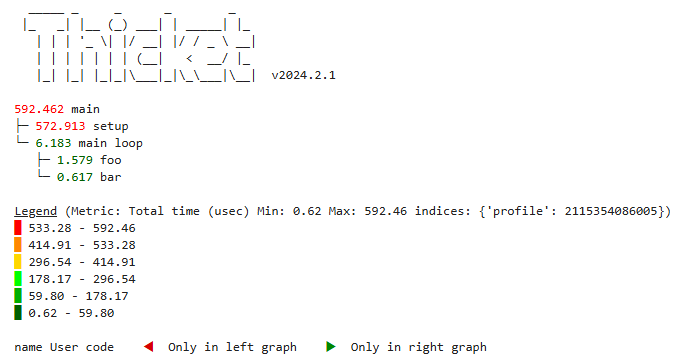

# Recording Data for Thicket, Hatchet, and TreeScape

Caliper is the primary way to collect data for the Python performance analysis
frameworks Thicket, Hatchet, and TreeScape:

* [Thicket](https://github.com/LLNL/thicket) is a Python-based toolkit for
  Exploratory Data Analysis (EDA) of parallel performance data on
  supercomputers.
* [Hatchet](https://github.com/LLNL/hatchet) is a Python framework for
  analyzing call-path profiles and serves as the data import backend for
  Thicket.
* TreeScape (coming soon) is a Python toolkit for visually analyzing large sets
  of call-path profiles, e.g. for performance regression testing or scaling
  studies.

## Preparing the code

Start by identifying code regions of interest and annotate them with Caliper
region markers as outlined in [Section 1](region_profiling.md). In addition,
add run metadata annotations with Adiak or Caliper as outlined in
[Section 2](recording_metadata.md). Metadata is especially important for
distinguishing and categorizing data in Thicket and TreeScape, which operate
on large sets of runs.

## Recording profiles with the spot recipe

Thicket, Hatchet and TreeScape import profiles in Caliper's `.cali` file format.
While the `.cali` format supports a wide spectrum of performance experiments, the
tools discussed here expect aggregate performance profiles. Caliper provides several
built-in recipes to create such profiles, primarily `spot` and `runtime-profile`:

* The `spot` recipe is the primary configuration for Thicket and TreeScape.
  It records summary performance statistics per Caliper region across MPI ranks.
* The `runtime-profile` recipe records performance data for each MPI rank.

In the following, we focus on the `spot` recipe. Spot always records the
minimum, maximum, average, and total inclusive time in seconds in each Caliper
region across MPI ranks (including for non-MPI programs, where all values are
identical). "Inclusive" means the reported time includes the time spent in any
nested sub-regions of a given Caliper region. Usually, spot also records the
exclusive times (i.e., the time spent in a region excluding the time spent in
nested sub-regions) and number of region invocations, again providing
minimum, average, maximum, and total values across MPI ranks. Additionally,
a variety of optional features can be enabled.
Run `cali-query --help spot` for a full list of options.

The spot recipe can be activated with the `CALI_CONFIG` environment variable or
through the `ConfigManager` API. Spot produces one `.cali` file per program
run with the aggregated performance data from all participating MPI ranks. We
recommend placing all `.cali` files belonging to the same experiment in a single 
directory. The `outdir` option can be helpful here. By default, spot generates
a unique file name that starts with the date and time of the run. Alternatively,
a custom file name can be provided in the `output` option. Make sure to use
unique file names for each run, as existing files with the same name will be
overwritten without warning.

Here is a simple example for recording profiles with the spot recipe:

    $ CALI_CONFIG=spot,outdir=thicket_experiment basic_example

This will place a `.cali` file in the `thicket_experiment` directory. We can
use `cali-query -T` to view the file contents on the command line:

    $ cali-query -T thicket_experiment/250429-105735_137467_5d56yY5hzYoT.cali
    Path        Min time/rank Max time/rank Avg time/rank Total time [...]
    main             0.000592      0.000592      0.000592   0.000592
      main loop      0.000006      0.000006      0.000006   0.000006
        bar          0.000001      0.000001      0.000001   0.000001
        foo          0.000002      0.000002      0.000002   0.000002
      setup          0.000573      0.000573      0.000573   0.000573 

## Loading Caliper data in Thicket

In Thicket, use `thicket.Thicket.from_caliperreader()` to create a Thicket
object from a list of Caliper files:

```Python
import glob
import thicket as tt

th = tt.Thicket.from_caliperreader(glob.glob("thicket_experiment/*.cali"))

# Create new metric column with time in microseconds
th.dataframe["Total time (usec)"] = 1e6*th.dataframe["Total time"]
# Print tree with new usec metric
print(th.tree(metric_column="Total time (usec)"))
```

Example output:



For more information, refer to the [Thicket documentation](https://thicket.readthedocs.io/en/latest/index.html).

[Next - Analyzing Data with cali-query](analysis_with_caliquery.md)

[Back to Table of Contents](README.md#tutorial-contents)